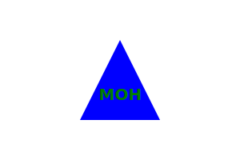

# Module-10-Challenge-OOP-SVG-Logo-Maker
Object-oriented Programming Challenge: SVG Logo Maker

 ## User Story
AS a freelance web developer
 
I WANT to generate a simple logo for my projects
 
SO THAT I don't have to pay a graphic designer

 ## Video Link
 [Walkthrough Video]()

 ## Description

 This project generates svg logo based on user input

 ## Installation

 Install the following:
  
 npm install node.js
  
 npm install inquirer
  
 npm install jest
  

 ## Usage

 Simply run "node index.js" command on the terminal to run 

 ## Logo Preview
 

 

 

 ## License

 

 This project is licensed under the [MIT License](https://choosealicense.com/licenses/mit/) license.

 ## Contributing

 Pull requests are most welcome

 ## Queries

 GitHub: https://github.com/jmorris38

 Email: jmorris38@outlook.com
